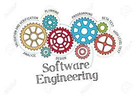

Software Engineering to me is a very powerful tool to have. It can have a large array of purposes including app development, web development, game development, etc. Almost anything can be created one you know about software engineering. I think it is one of, if not, the most powerful tool to have in the computer science world. There is no harm in knowing the processes of a program and how to execute it.

Software Engineering slightly reminds me of Business. It's a very general category of a real-world useful tool. They both are the big umbrella to sub categories (like mentioned above), while also having large benefits of just knowing it on its own. I also think that they both can stand on their own in the sense that you kind of have to know it to be good at it. Not everyone can just get a business or software engineering job.

With that being said, I hope to be able to think, plan, and execute programs on my own in a timely matter. My unrealistic goal would be to not have to refer to too many other sources, but I am beginning to learn that the trick to Computer science is to use your resources to get optimal code and execution. Another thing that I hope to learn is how I can apply software engineerig to my field of interest (Cyber Security). I know software engineering is probably easily applied to almost any job, but I would love to learn more specifically how I can create a better network, website, etc. or how to make something "hack-proof". 

Overall, I am satisfied with just learning Javascript so far from this software engineering class because it has been such a fun, internesting, and informative experience! I initially found interest in Computer Science beacuse I enjoyed coding and I thought that was kind of rare. Now that we code a lot more with different languages and processes, I can still say that I genuinely enjoy coding and it confirms my instinct to go into the computer science world. I look forward to broadening my knowledge and experience as I step into this semi-new world.
