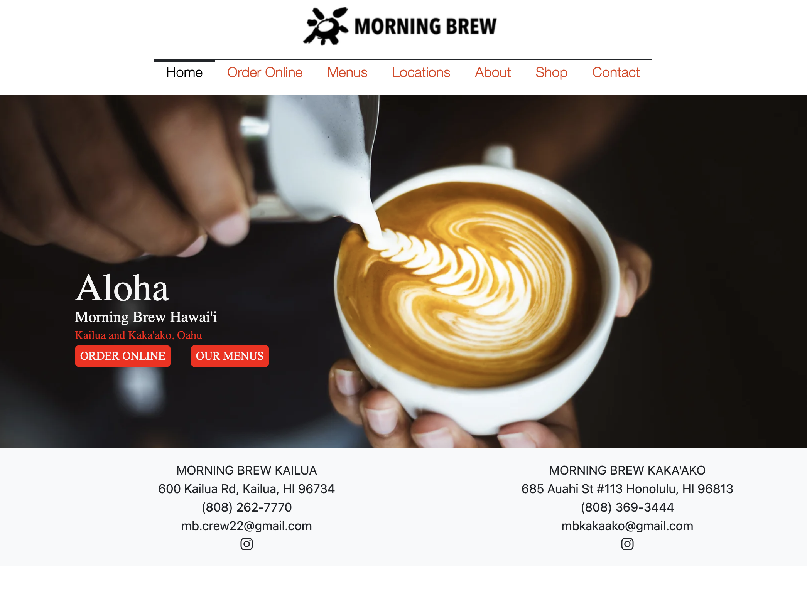

Welcome to the world of UI Frameworks, but more specifically, Bootstrap 5. To start, a UI Framework is a User Interface Framework that is a set of pre-designed and pre-coded elements, components, and tools for developers to use to create a website or software application. Bootstrap 5 is a popular type of UI Framework that allows for "easy" use, pre-built applications, customization, the integration of Javascript components, and more. However, like everything in the world, Bootstrap 5 has both its conveniences, and inconveniences. Let's end on the good note: Bootstrap has a moderate learning curve and limited design freedom, but Bootstrap can also be functional, efficient, and effective.

<h2> The learning curve and design freedom </h2> 
As a beginner web designer and software engineer, I found the learning process and comprehension of Bootstrap 5 to be slightly more difficult than most other languages I have learned. From learning the placements of each setting to the order in which you code things for a desired outcome, then combining multiple techniques together get confusing. For example, I had an assignment (attached below) where I needed to center my nav bar items, but whenever I used "justify-content-center", it wouldn't change anything, but after moving it around, I found out that the location of which I tried to make this change was wrong. Some other things that I feel are hard to grasp are the notations like "<div>...</div>" and the classes. Knowing when to use certain classes versus knowing when to use the stylesheet is hard to remember. Although either way may work, there is usually a better way to do it, which can be hard to differentiate.

Along with the learning curve, the lack of design freedom can be a possible con for those who are more interesting in full creative design freedom. Because Bootstrap uses a lot of pre-design and pre-coded tools, trying to completely customize a website to a specific liking can be a hassle and take a lot of time in effort. For example, trying to put text on top of an image requires the manual input of each x and y coordinate of the text relating to the website page. So, the trial and error process is used to determine exactly where you want the text to be placed. Although I still have much to learn about Bootstrap and there may be shorter, easier ways to do this specific examples' task, this beginner way can be seen as time-consuming and inefficient.

<h2> The innovation and functionality </h2> 
Bootstrap to me is very innovative. So far, I feel like there are things that are built into the program that allows an effective execution process. For example, the grid system. When trying to create a footer for a website, there are things like row and col (column) to help create two or more columns with multiple rows within in column. This can be seen through the example below. The very bottom of the page shows 2 locations of this cafe called Morning Brew. We start by identifying the row, which is the row in while these two column will be located in. Then, the first column would be "MORNING BREW KAILUA" while the second column is "MORNING BREW KAKA'AKO". From there, in each column, as we type a new line of code, a new line of text will be presented on the screen. In this same example, after the line consisting of "MORNING BREW KAILUA", the next line will put the address of the location, the line after that includes the phone number, then the email, etc. This process of grid systems allow for there to be organization and a little more customization in terms of how you want the website formatted.

Another example of Bootstraps functionality and innovative could be its untility classes. Although, at first, it is hard to get the hang of these classes and knowing when to use what, they become very handy and convenient in the long run. From little things to being able to customize a section (or container) within the html code rather than the CSS code saves time.
For example, continuing with the same website example,
```
  ...
    <div class="container justify-content-center">
      ...
    </div>
  ...
```
allows for everything within this container to be centered. This is useful for this website in particular because in the navbar, all of the nav items need to be centered. However, the longer way of doing this would be to give the class a name then go to the CSS file to add the style customizations to the class, as shown below.
HTML File:
```
  ...
    <div class="navbarstyle container">
      ...
    </div>
  ...
```
CSS File:
```
  ...
    .navbarstyle {
      text.align: center;
    }
  ...
```

<h2> My webpage experience </h2> 

<p align="center">
  
</p>

The example that I have been referring to this far is from a bootstrap assignment that I had done in class. I chose this example because it was tedious and challenging, but made me feel relieved and accomplished after doing it. Some of the things that I struggled with during this assignment was similar to the things I mentioned above. Trying to put the proper code in the proper line and order, adjusting the style specificaitons like the text above the image, the colors, and the buttons all took a lot of time. Of course, with more practice, it becomes easier and familiar, however, with the experience I have right now, it was the perfect assignment that was challenging, yet, possible in a decent amount of time (though not quite fast enough).

<p align="center">
  
  
</p>

Another example of a website I did that was both challenging, but informative and good experience was an assignment where we mimicked a site of our choosing, which I chose the Abercrombie & Fitch website. The most challenging part of this website for me was trying to figure out how to merge the two "main" images together to where there was no white space in between. Though it may seem simple, I tried many different ways, referring to many different sources, and eventually, with the help of my friend and ChatGPT, I was able to semi-do it, but still not exact. None-the-less, this website only broadened my knowledge and experience with bootstrap and website development.

<h2> Concluding Remarks </h2>
Overall, I feel like my biggest personal conclusion is that although bootstrap sounds simple and have many efficient tools, trying to make a website that is completely perfect is extremely difficult, especially as a beginner. Not only is it hard to know which class, command, or tool to use, but it can also be hard to know when each tool is more appropriate than another. So far, bootstrap is the only type of UI Framework that I have experience with, but I think I would recommend it because of its efficiency and built-in classes and designs. It may not be the best one or the easiest to learn, but I still think it is a useful tool when creating websites, especially when starting out. Then, when you are more comfortable with website development and software engineering, you can move on to more intricate and advanced types of UI Frameworks that may or may not be better.
