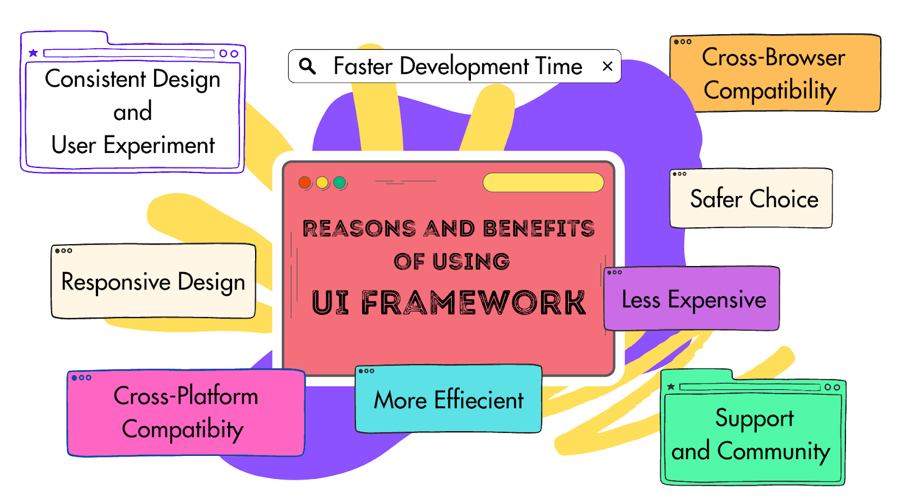
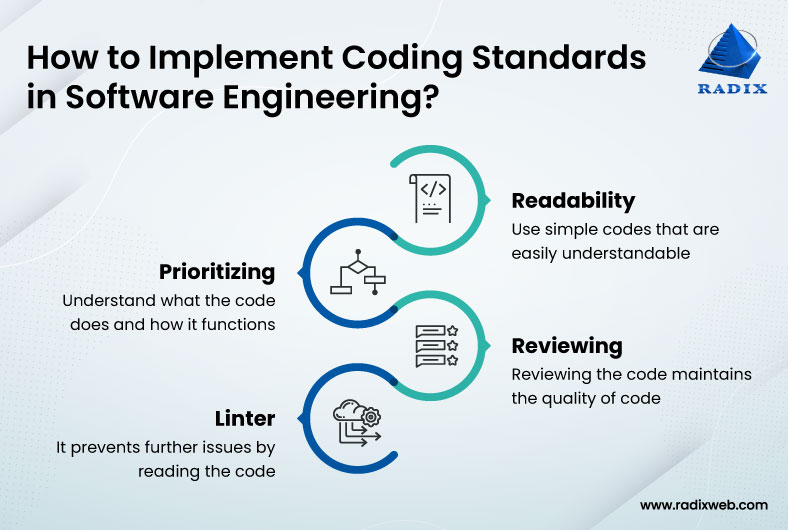

  

Throughout this past semester, I was able to dip my feet into the software engineering realm where I got a sneak peak of what it feels like to built custom and cool applications, website, or just functions in general. Although my specific interest is in Cyber Security, there wasn't a moment where I thought I was learning useless information.

Learning things like user interface frameworks, coding standards, and agile project management are all skills that not only will help me in my future career endeavors, but also life in general. Whether I actually end up in the computer science world or not, I think these basic, yet useful topics will take me far in life.

## User Interface Frameworks

  

User interface frameworks will forever be one of my favorite things that I learned from this software engineering class. To think that someone built a UI Toolkit to make coding easier makes me so happy and hopeful that this toolkit will only expand to the extent where it would have almost everything. From containing pre-built UI components like buttons, text-fields, checkboxes, etc., to having the grid layout system, to even event handling, the UI toolkits uses are endless.

Now, what more could I do with this than create a pretty and working website? Well, since my goal is to work in the Computer Science industry, grids, pre-built UI components, event handling, etc., will all be used in no matter what I do with it. An example could be if I worked in the Cyber Security world, how will I know what I'm trying to protect when I don't know what the code is saying or what the grid system is/looks like?

UI frameworks can also be found in things like interactive displays, gaming/entertainment, simulations/training systems, educational/learning applications, healthcare/medical devices, and more! UI frameworks can be found almost anywhere and everything. If it has a visual display or system, it probably has some sort of UI framework built in, and being able to understand such a common tool for coding can be helpful to understand how systems work.

## Coding Standards

  

Although coding is still somewhat similar to software engineering, universal coding tips like coding standards can go a long way in the technology industry. Not only is knowing what coding standards are useful, but being able to put them into practice, make them a habit, and surprise everyone when your code is highly organized, efficient, and consistent is a flex everyone should want.

Learning about coding standards could also get someone used to being clean and even outside of the coding world. Knowing about a process that keeps things efficient could influence and inspire for one to create similar processes for other life tasks. For example, when taking notes for a class, we can have note standards where like coding standards, it allows for all of the notes to be clean, consistent, organized, and easy to follow even when it isn't yours. Naming conventions in coding standards could replicate setting up for the chapter, section, titles, subsections, etc. the same. Color-coding notes could also be a considered a note standard because to make color-coding work most efficiently, it's best if the colors and what they are related to stay consistent throughout all of the notes so there is not confusion.

Knowing coding standards not only allows for code to be organized and nice, but it can also lead to the creation of consistent standards in other tasks, such as taking notes. There is no such thing as being too organized or having too much consistency because the more organized and consistent means the more clarity and ease there is.

## Agile Project Management

  

Agile project management is one of the most useful things we have learned this semester. Unless you are a major or have specialty interest in management, I think management skills can have infinitely many applications to life, even outside of the projects world. 

From managing yourself to managing a small group, then a big group, then a division, and so on, being able to have a good backbone of managing is helpful. Learning how to set up a plan from the ground, assign people, deadlines, descriptions, tasks, etc., then moving more and more forward until you see there is nothing more to add to the projects is the essence of agile project management. Starting at the very beginning and taking baby steps to get to the desired outcome. Holding everyone in the project accountable for their tasks and deadlines. From working on everyday tasks to large projects, being able to manage your work wisely and efficiently is a skill that not everyone has, but everyone can benefit from. 

## Concluding Remarks
Although these are not the only topics within the Software Engineering world that can be applied to the outside world, they are my favorite ones. Learning new ways to be more organized, clean, and efficient is one of my favorite things to do, and being able to see it, learn it, use it, and even apply it to a wide array of scenarios is really amazing. 

From the computer, to the kitchen, to work, to taking care of the house, being able to know how things works from knowledge of UI Frameworks, to how to standardize organization systems like Coding Standards, to learning how to not only manage projects, but life, are all skills I will take on with me as I move forward in life. It has been so cool to see how much my knowledge has built up in just 3 years, and how this software engineering class seemed to be the next level of initiating my progress forward.
