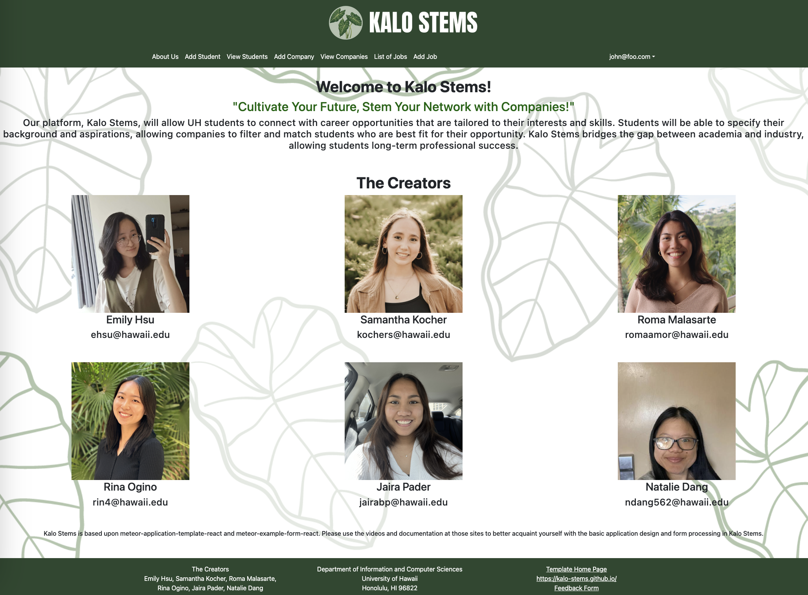
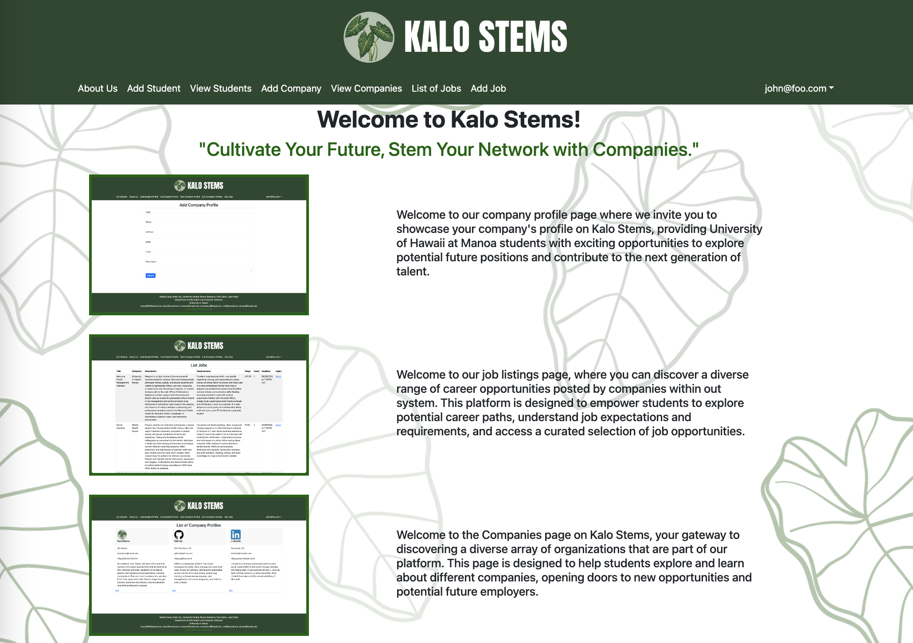
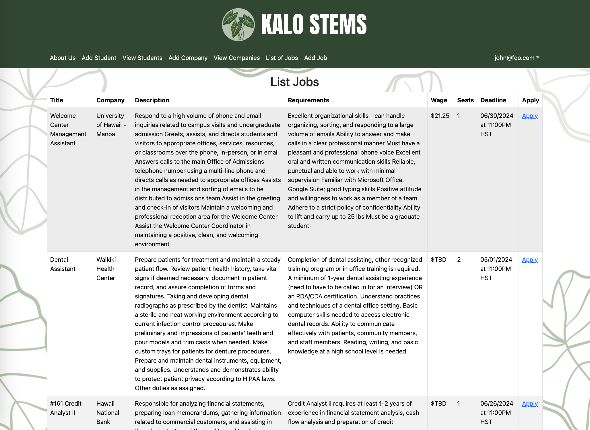
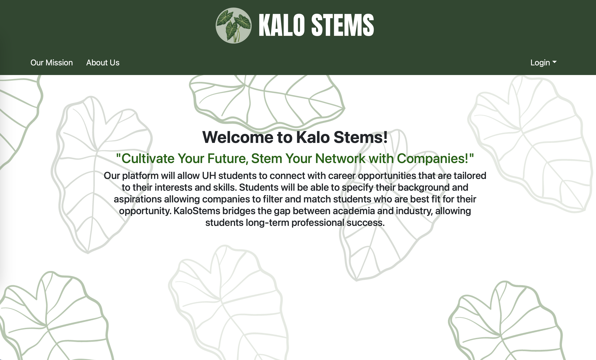

  

Kalo Stems is an application that allows the University of Hawaii at Manoa students to connect with career opportunities from companies who create an account on our application. Kalo Stems bridges the gap between academia and industry, opening the opportunity for students to have long-term professional success. Although, we originally planned on having a filtering system to where students can filter companies and companies and filter students, due to time and lack of knowledge, it was hard to implement. However, we were able to create different pages where there are lists of student profiles, company profiles, and job opportunities/positions. 

<h2>My Role</h2>
To start, I volunteered for that task that included creating the landing page of our application. As this is the first page that comes up when opening our application, it was important for me to make sure it included a clear understanding of our application's goals and what to expect from it. On top of user understanding, this was also the step where we decided on our applications theme (including colors, logo, fonts, etc.). This step was pivotal in establishing a cohesive and appealing visual identity that aligned with our project's objectives and target audience. As our project progressed, my primary responsibility centered on continuously updating and refining the landing page to enhance its effectiveness and user experience. Beyond this role, I actively contributed to the development of other key pages such as "List Jobs" and "Edit List Jobs," ensuring consistency in design and functionality across the application.

Throughout the duration of our project, we implemented a structured approach to foster collaboration and monitor progress effectively. One of our key practices was the regular scheduling of weekly meetings dedicated to assessing each team member's progress and addressing any challenges or roadblocks. These meetings provided a valuable forum for exchanging ideas, sharing updates, and ensuring alignment towards our project goals.

Moreover, we maximized our in-class workshop time by actively managing our project board. This involved meticulously maintaining and updating the project board to reflect the current status of tasks and objectives. We conducted regular reviews of all listed issues or tasks to ensure clarity in instructions and feasibility within specified deadlines. This iterative process allowed us to refine our task list continuously, ensuring that every item was essential, actionable, and aligned with project milestones.

Below are screenshots of the landing page and list jobs page. Although my teammate Emily did majority of the work, I helped with minor touches in and around the application.

  

<h2>Future Goals</h2>
Some things that I hope our group could come together to adjust our application is to finally implement a filtering system and even maybe a search system. Being able to search and filter our database could make a big impact on making our application more user-friendly. On top of these two systems, it would be cool if we use whatever knowledge we may have gained to create a student-company matching system. Although this adjustment will take a while and is a big task, I feel like creating the matching system, almost similar to dating websites, could be really cool and interactive.

<h2>Things Learned</h2>
One of my biggest lessons from this project was learning how to manage projects. Being able to not only learn, but implement an organized and efficient system to keep not only me but the group on task and adhering to the deadlines was highly knowledgeable for me. This skill and knowledge is now something I can take with me for any other class, project, task, or even job.

On top of learning about project management, this experience also allowed me to build on my research skills to create new and different designs to match our theme. For example, as I was editing the landing page to have the sample images stacked on top of each other rather than next to each other, I researched how to do it first. However, I couldn't seem to find the answer I was looking for, so I tried to look at fellow classmates' project landing page, and although I saw some patterns, I ended up using their samples, my samples, and my knowledge to start to connect the dots of what we already learned. To conclude my research, I found that creating a whole new page to contain the images and description, then calling it into our landing page is what solved my problem. After that, I just had to do a similar process to fix minor aesthetic errors.
  Here is the before, very first mockup:

  

Compared to our current, newest one:

  

